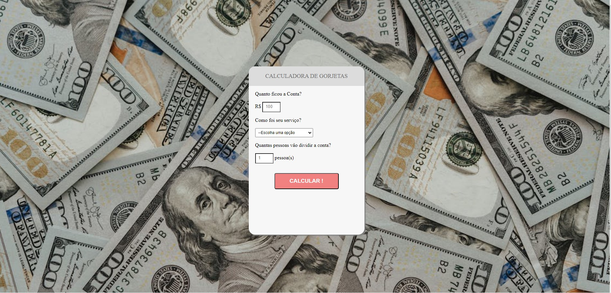

<h1 align="center"> Calculadora de Gorjetas </h1>

Calculadora de gorjetas desenvolvido pelo Linkedin Learning  

  

## 🚀 Tecnologias

Esse projeto foi desenvolvido com as seguintes tecnologias:

- HTML e CSS
- JavaScript
- Git e Github

## 💻 Projeto

A Calculadora foi desenvolvida para mostrar o poder que a linguagem JavaScript tem nas aplicações. 

- [visite o projeto online] (https://gsilvaol.github.io/nlw-setup/)

